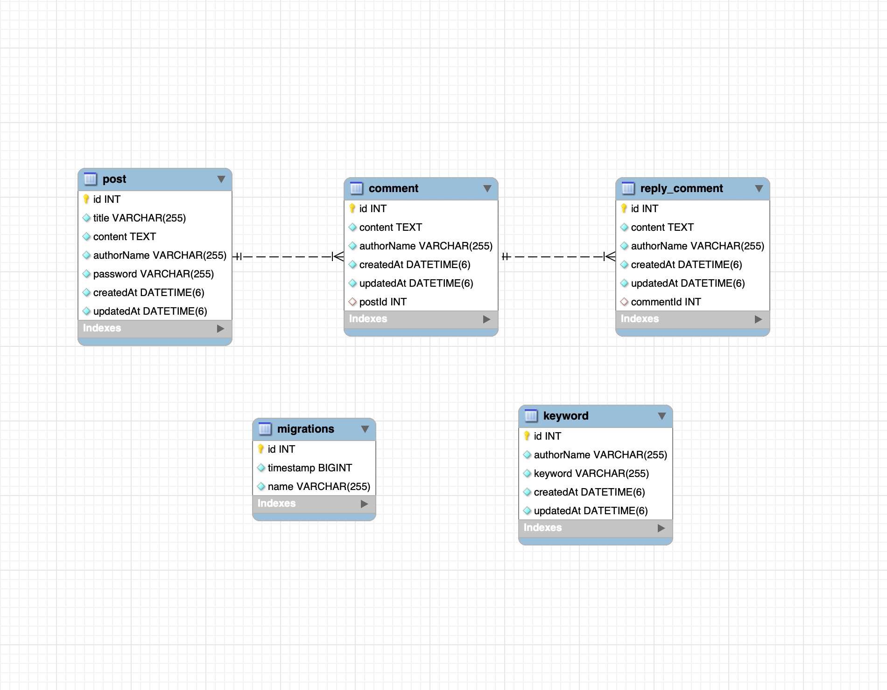

# Nest.js Posts 구현

# 프로젝트 기술 명세

- Nest.js
- typeorm
    - Database ORM
- util
    - lodash
    - bcrypt
    - dotenv

# 프로젝트 버전 명세

- NestJS - 11
- Nodejs - 22
- typescript - ^5.7.0

# 프로젝트 디렉토리 구조

```
nest-post/
├── src/
│   ├── comments/
│   │   ├── dto/
│   │   │   ├── create-comment.dto.ts
│   │   │   ├── create-reply-comment.dto.ts
│   │   │   └── get-comments.dto.ts
│   │   ├── comment.controller.ts
│   │   ├── comment.module.ts
│   │   └── comment.service.ts
│   ├── libs/
│   │   ├── database/
│   │   │   ├── migrations/
│   │   │   │   └── 1747457653740-InitSchema.ts
│   │   │   ├── post/
│   │   │   │   ├── entity/
│   │   │   │   │   ├── comment.entity.ts
│   │   │   │   │   ├── keyword.entity.ts
│   │   │   │   │   ├── post.entity.ts
│   │   │   │   │   └── reply-comment.entity.ts
│   │   │   │   ├── repository/
│   │   │   │   │   ├── comment.repository.ts
│   │   │   │   │   ├── keyword.repository.ts
│   │   │   │   │   ├── post.repository.ts
│   │   │   │   │   └── reply-comment.repository.ts
│   │   │   │   └── post.module.ts
│   │   │   └── data-source.ts
│   │   ├── module/
│   │   │   └── keyword.module.ts
│   │   ├── service/
│   │       └── keyword.service.ts
│   ├── posts/
│   │   ├── dto/
│   │   │   ├── create-post.dto.ts
│   │   │   ├── delete-post-by-id.dto.ts
│   │   │   ├── get-post-by-id.dto.ts
│   │   │   ├── get-posts.dto.ts
│   │   │   └── update-post.dto.ts
│   │   ├── post.controller.ts
│   │   ├── post.module.ts
│   │   └── post.service.ts
│   ├── app.module.ts
│   └── main.ts
├── README.md
├── eslint.config.mjs
├── nest-cli.json
├── package-lock.json
├── package.json
├── tsconfig.build.json
└── tsconfig.json

```
- posts
  - 게시글 관련 API 구현 
- comments
  - 댓글 관련 API 구현
- libs
  - 프로젝트 공통 사용 로직  
  - database
    - DATABASE 단위의 typeORM entity, repository
  - service
    - 공통 Service 로직

# 로컬 개발환경 설정 방법

## Install

```shell
nvm use 22
npm ci
```

## Database 설정

localhost Database 생성 필요
- localhost Database 정보는 .env 파일 참조

```mysql
CREATE DATABASE post
```

스키마 생성 및 초기 데이터 추가

```shell
npm run migration:run
```

## localhost 구동

```shell
npm run start:dev
```

- [Swagger](http://localhost:3000/api/swagger)

# API End-points

## 게시글
- [GET] /api/posts
- [POST] /api/posts
- [PUT] /api/posts/:id
- [DELETE] /api/posts/:id

## 댓글
- [GET] /api/comments
- [POST] /api/comments
- [POST] /api/comments/reply

## 키워드 알림
- 콘솔 로그로 출력

```
알림: 짱구님이 등록한 키워드 "안녕"가 포함된 글이 작성되었습니다.
```

# Database Schema

- 게시글 (post) : 댓글 (comment) = 1 : N
- 댓글 (comment) : 대댓글 (reply_comment) = 1 : N

  